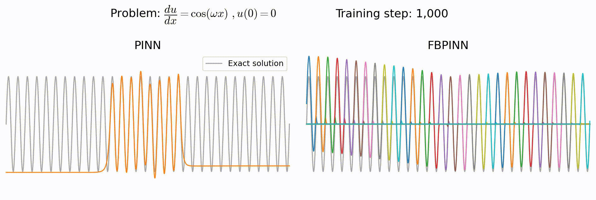
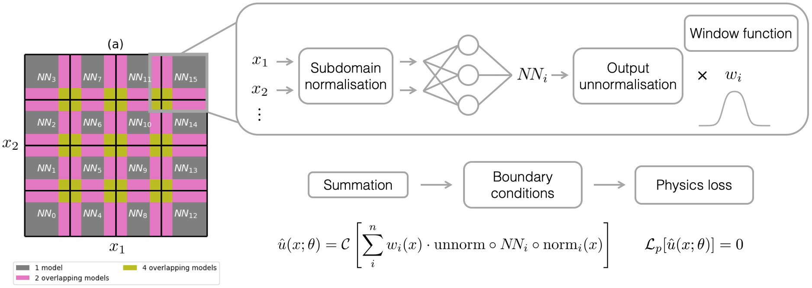

# Finite basis physics-informed neural networks (FBPINNs)
---

This repository reproduces the results of the paper *[Finite Basis Physics-Informed Neural Networks (FBPINNs): a scalable domain decomposition approach for solving differential equations](https://arxiv.org/abs/2107.07871), B. Moseley, T. Nissen-Meyer and A. Markham, Jul 2021 ArXiv*.

---

## Key contributions

- Physics-informed neural networks (PINNs) offer a powerful new paradigm for solving problems relating to differential equations
- However, a key limitation is that PINNs struggle to scale to problems with **large domains** and/or **multi-scale solutions**
- We present *finite basis physics-informed neural networks (FBPINNs)*, which are able to scale to these problems
- To do so, FBPINNs use a combination of **domain decomposition**, **subdomain normalisation** and **flexible training schedules**
- FBPINNs outperform PINNs in terms of accuracy and computational resources required



## Workflow



FBPINNs divide the problem domain into many small, overlapping subdomains. A neural network is placed within each subdomain such that within the center of the subdomain, the network learns the full solution, whilst in the overlapping regions, the solution is defined as the sum over all overlapping networks. 

We use smooth, differentiable window functions to locally confine each network to its subdomain, and the inputs of each network are individually normalised over the subdomain.

In comparison to existing domain decomposition techniques, FBPINNs do not require additional interface terms in their loss function, and they ensure the solution is continuous across subdomain interfaces by the construction of their solution ansatz.

## Installation

`FBPINNs` only requires Python libraries to run.

We recommend setting up a new environment, for example:

```bash
conda create -n fbpinns python=3  # Use conda package manager
conda activate fbpinns
```
and then installing the following libraries:
```bash
conda install scipy matplotlib jupyter
conda install pytorch torchvision torchaudio cudatoolkit=10.2 -c pytorch
pip install tensorboardX
```

All of our work was completed using **PyTorch version 1.8.1** with **CUDA 10.2**.

Finally, download the source code:

```bash
git clone https://github.com/benmoseley/FBPINNs.git
```

## Getting started

The workflow to train and compare FBPINNs and PINNs is very simple to set up, and consists of three steps:

1. Initialise a `problems.Problem` class, which defines the differential equation (and boundary condition) you want to solve
2. Initialise a `constants.Constants` object, which defines all of the other training hyperparameters (domain, number of subdomains, training schedule, .. etc)
3. Pass this `Constants` object to the `main.FBPINNTrainer` or `main.PINNTrainer` class and call the `.train()` method to start training.

For example, to solve the problem du/dx = cos(wx) shown above you can use the following code to train a FBPINN / PINN:

```python
P = problems.Cos1D_1(w=1, A=0)# initialise problem class

c1 = constants.Constants(
            RUN="FBPINN_%s"%(P.name),# run name
            P=P,# problem class
            SUBDOMAIN_XS=[np.linspace(-2*np.pi,2*np.pi,5)],# defines subdomains
            SUBDOMAIN_WS=[2*np.ones(5)],# defines width of overlapping regions between subdomains
            BOUNDARY_N=(1/P.w,),# optional arguments passed to the constraining operator
            Y_N=(0,1/P.w,),# defines unnormalisation
            ACTIVE_SCHEDULER=active_schedulers.AllActiveSchedulerND,# training scheduler
            ACTIVE_SCHEDULER_ARGS=(),# training scheduler arguments
            N_HIDDEN=16,# number of hidden units in subdomain network
            N_LAYERS=2,# number of hidden layers in subdomain network
            BATCH_SIZE=(200,),# number of training points
            N_STEPS=5000,# number of training steps
            BATCH_SIZE_TEST=(400,),# number of testing points
            )

run = main.FBPINNTrainer(c1)# train FBPINN
run.train()

c2 = constants.Constants(
            RUN="PINN_%s"%(P.name),
            P=P,
            SUBDOMAIN_XS=[np.linspace(-2*np.pi,2*np.pi,5)],
            BOUNDARY_N=(1/P.w,),
            Y_N=(0,1/P.w,),
            N_HIDDEN=32,
            N_LAYERS=3,
            BATCH_SIZE=(200,),
            N_STEPS=5000,
            BATCH_SIZE_TEST=(400,),
            )

run = main.PINNTrainer(c2)# train PINN
run.train()
```

The training code will automatically start outputting training statistics, plots and tensorboard summaries. The tensorboard summaries can be viewed by installing [tensorboard](https://www.tensorflow.org/tensorboard) and then running the command line `tensorboard --logdir fbpinns/results/summaries/`.

#### Defining your own `problem.Problem` class

To learn how to define and solve your own problem, see the [Defining your own problem Jupyter notebook here](https://github.com/benmoseley/FBPINNs/blob/main/examples/Defining%20your%20own%20problem.ipynb).

## Reproducing our results

The purpose of each folder is as follows:

- `fbpinns` : contains the main code which defines and trains FBPINNs.
- `analytical_solutions` : contains a copy of the [BURGERS_SOLUTION code](https://people.sc.fsu.edu/~jburkardt/py_src/burgers_solution/burgers_solution.html) used to compute the exact solution to the Burgers equation problem.
- `seismic-cpml` : contains a Python implementation of the [SEISMIC_CPML FD library](https://github.com/geodynamics/seismic_cpml) used to solve the wave equation problem.
- `shared_modules` : contains generic Python helper functions and classes.

To reproduce the results in the paper, use the following steps:

1. Run the scripts `fbpinns/paper_main_1D.py`, `fbpinns/paper_main_2D.py`, `fbpinns/paper_main_3D.py`. These train and save all of the FBPINNs and PINNs presented in the paper.
2. Run the notebook `fbpinns/Paper plots.ipynb`. This generates all of the plots in the paper.

## Further questions?

Please raise a GitHub issue or feel free to contact us.
