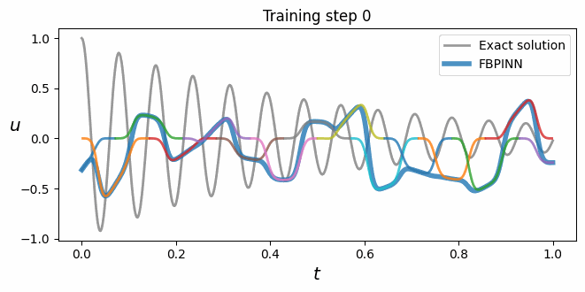
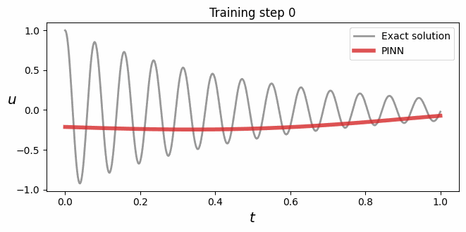
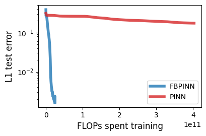
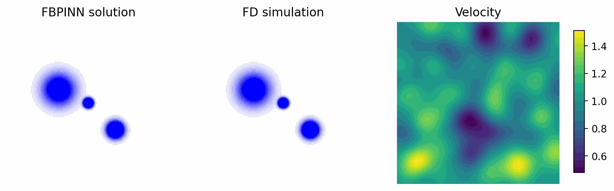
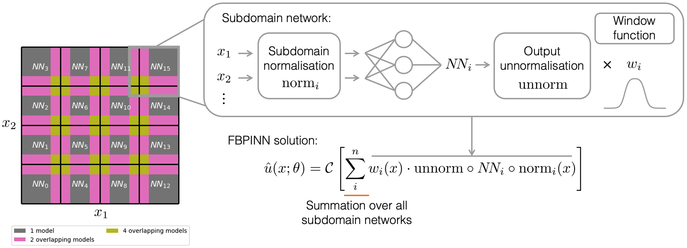
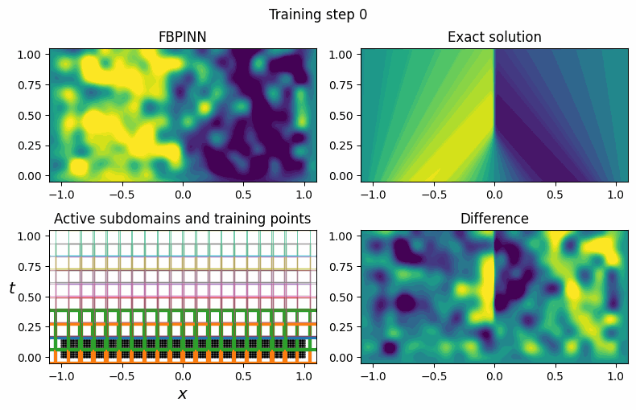

# Finite basis physics-informed neural networks (FBPINNs)

---

This repository allows you to solve forward and inverse problems related to partial differential equations (PDEs) using **finite basis physics-informed neural networks** (FBPINNs).

> 🔥 MAJOR UPDATE 🔥: we have rewritten the `fbpinns` library in [JAX](https://jax.readthedocs.io/en/latest/index.html): it now runs 10-1000X faster than the original PyTorch code (by parallelising subdomain computations using `jax.vmap`) and scales to 1000s+ subdomains. We have also added extra functionality: you can now solve inverse problems, add arbitrary types of boundary/data constraints, define irregular/multilevel domain decompositions and custom subdomain networks, and the high-level interface is much more flexible and easier to use. See the [Release note](https://github.com/benmoseley/FBPINNs/releases/tag/v0.2.0) for more info.

FBPINNs are described in detail here: *[Finite Basis Physics-Informed Neural Networks (FBPINNs): a scalable domain decomposition approach for solving differential equations](https://link.springer.com/article/10.1007/s10444-023-10065-9), B. Moseley, T. Nissen-Meyer and A. Markham, Jul 2023 Advances in Computational Mathematics*.

---

<p align="center">
    
    
</p>
<p align="center">
    
</p>
<p align="center">
    <b>Fig 1: FBPINN vs PINN solving the high-frequency 1D harmonic oscillator</b>
</p>

## Why FBPINNs?

- [Physics-informed neural networks](https://benmoseley.blog/my-research/so-what-is-a-physics-informed-neural-network/) (PINNs) are a popular approach for solving **forward and inverse problems** related to PDEs
- However, PINNs often struggle to solve problems with **high frequencies** and/or **multi-scale solutions**
- This is due to the **spectral bias** of neural networks and the **heavily increasing complexity** of the PINN optimisation problem
- FBPINNs improve the performance of PINNs in this regime by combining them with **domain decomposition**, **individual subdomain normalisation** and **flexible subdomain training schedules**
- Empirically, FBPINNs **significantly outperform** PINNs (in terms of accuracy and computational efficiency) when solving problems with high frequencies and multi-scale solutions (Fig 1 and 2)

<p align="center">
    
</p>
<p align="center">
    <b>Fig 2: FBPINN solution of the (2+1)D wave equation with multiscale sources</b>
</p>

## How are FBPINNs different to PINNs?

<p align="center">
    
</p>
<p align="center">
    <b>Fig 3: FBPINN workflow overview</b>
</p>

To improve the scalability of PINNs to high frequency/ multiscale solutions:

- FBPINNs divide the problem domain into many small, **overlapping subdomains** (Fig 3). 

- A neural network is placed within each subdomain, and the solution to the PDE is defined as the **summation over all subdomain networks**.

- Each subdomain network is **locally confined** to its subdomain by multiplying it by a smooth, differentiable window function.

- Finally, the inputs of each network are **individually normalised** over their subdomain.

The hypothesis is that this "divide and conquer" approach significantly reduces the complexity of the PINN optimisation problem. Furthermore, individual subdomain normalisation ensures the "effective" frequency each subdomain network sees is low, reducing the effect of spectral bias.

## Subdomain scheduling

<p align="center">
    
</p>
<p align="center">
    <b>Fig 4: Solving the time-dependent Burgers' equation using a time-stepping subdomain scheduler</b>
</p>

Another advantage of using domain decomposition is that we can control which **parts** of the domain are solved at each training step.

This is useful if we want to control how boundary conditions are **communicated** across the domain.

For example, we can define a **time-stepping scheduler** to solve time-dependent PDEs, and learn the solution forwards in time from a set of initial conditions (Fig 4).

This is done by specifying a **subdomain scheduler** (from `fbpinns.schedulers`), which defines which subdomains are actively training and which subdomains have fixed parameters at each training step.


## Installation

`fbpinns` only requires Python libraries to run.

> [JAX](https://jax.readthedocs.io/en/latest/index.html) is used as the main computational engine for `fbpinns`.

To install `fbpinns`, we recommend setting up a new Python environment, for example:

```bash
conda create -n fbpinns python=3  # Using conda
conda activate fbpinns
```
then cloning this repository:
```bash
git clone git@github.com:benmoseley/FBPINNs.git
```
and running this command in the base `FBPINNs/` directory (will also install all of the dependencies):
```
pip install -e .
```
> Note this installs the `fbpinns` package in "editable mode" - you can make changes to the source code and they are immediately present in the package.

## Getting started

Forward and inverse PDE problems are defined and solved by carrying out the following steps:

1. Define the **problem domain**, by selecting or defining your own `fbpinns.domains.Domain` class
2. Define the **PDE** to solve, and any **problem constraints** (such as boundary conditions or data constraints), by selecting or defining your own `fbpinns.problems.Problem` class
3. Define the **domain decomposition** used by the FBPINN, by selecting or defining your own `fbpinns.decompositions.Decomposition` class
4. Define the **neural network** placed in each subdomain, by selecting or defining your own `fbpinns.networks.Network` class
5. Keep track of all the training hyperparameters by passing these classes and their initialisation values to a `fbpinns.constants.Constants` object
6. Start the FBPINN training by instantiating a `fbpinns.trainers.FBPINNTrainer` using the `Constants` object.

For example, to solve the 1D harmonic oscillator problem shown above (Fig 1):

```python
import numpy as np

from fbpinns.domains import RectangularDomainND
from fbpinns.problems import HarmonicOscillator1D
from fbpinns.decompositions import RectangularDecompositionND
from fbpinns.networks import FCN
from fbpinns.constants import Constants
from fbpinns.trainers import FBPINNTrainer

c = Constants(
    domain=RectangularDomainND,# use a 1D problem domain [0, 1]
    domain_init_kwargs=dict(
        xmin=np.array([0,]),
        xmax=np.array([1,]),
    ),
    problem=HarmonicOscillator1D,# solve the 1D harmonic oscillator problem
    problem_init_kwargs=dict(
        d=2, w0=80,# define the ODE parameters
    ),
    decomposition=RectangularDecompositionND,# use a rectangular domain decomposition
    decomposition_init_kwargs=dict(
        subdomain_xs=[np.linspace(0,1,15)],# use 15 equally spaced subdomains
        subdomain_ws=[0.15*np.ones((15,))],# with widths of 0.15
        unnorm=(0.,1.),# define unnormalisation of the subdomain networks
    ),
    network=FCN,# place a fully-connected network in each subdomain
    network_init_kwargs=dict(
        layer_sizes=[1,32,1],# with 2 hidden layers
    ),
    ns=((200,),),# use 200 collocation points for training
    n_test=(500,),# use 500 points for testing
    n_steps=20000,# number of training steps
    optimiser_kwargs=dict(learning_rate=1e-3),
    show_figures=True,# display plots during training
)

run = FBPINNTrainer(c)
run.train()# start training the FBPINN
```

The `FBPINNTrainer` will automatically start outputting training statistics, plots and tensorboard summaries. The tensorboard summaries can be viewed by installing [tensorboard](https://www.tensorflow.org/tensorboard) and then running `tensorboard --logdir results/summaries/`

### Comparing to PINNs

You can easily train a PINN using the same hyperparameters above, using:

```python
from fbpinns.trainers import PINNTrainer

c["network_init_kwargs"] = dict(layer_sizes=[1,64,64,1])# use a larger neural network
run = PINNTrainer(c)
run.train()# start training a PINN on the same problem
```

## Going further

See the [examples](https://github.com/benmoseley/FBPINNs/tree/main/examples) folder for more advanced examples covering:
- how to define your own `Problem` class
- how to use hard boundary constraints
- how to solve an inverse problem
- how to use subdomain scheduling


## FAQs


### Installation

I get the error: `RuntimeError: This version of jaxlib was built using AVX instructions, which your CPU and/or operating system do not support.` when using Apple GPUs.
- As of this commit, JAX only has experimental support for Apple GPUs. Either build JAX from [source](https://developer.apple.com/metal/jax/) or install a CPU-only version using conda: `pip uninstall jax jaxlib` and `conda install jax -c conda-forge`

### Using GPUs

How do I train FBPINNs using a GPU?
- Exactly the same code should run on a GPU automatically, without needing any modification. Make sure you have installed the GPU version of JAX, and that JAX can see your GPU devices (e.g. by checking `jax.devices()`)

### Understanding the repository
But I don't know JAX!?
- We highly recommend becoming familiar with JAX - it is a fantastic, general-purpose library for accelerated differentiable computing. But even if you don't want to learn JAX, that's ok - all of the front-end classes (`Domain`, `Problem`, `Decomposition`, and `Network`) can be defined with only basic understanding of `jax.numpy` (which is essentially the [same](https://jax.readthedocs.io/en/latest/jax-101/01-jax-basics.html) as `numpy` anyway).

### Methodology

How are FBPINNs different to other PINN + domain decomposition methods?
- In contrast to other PINN + domain decomposition methods (such as [XPINNs](https://global-sci.org/intro/article_detail/cicp/18403.html)), FBPINNs by their mathematical construction **do not require additional interface terms** in their loss function, and their **solution is continuous** across subdomain interfaces. Essentially, FBPINNs can just be thought of as defining a custom neural network architecture for PINNs - everything else stays the same.


## Citation

If you find FBPINNs useful and use them in your own work, please use the following citations:

```
@article{Moseley2023,
author = {Moseley, Ben and Markham, Andrew and Nissen-Meyer, Tarje},
doi = {10.1007/S10444-023-10065-9},
journal = {Advances in Computational Mathematics 2023 49:4},
month = {jul},
number = {4},
pages = {1--39},
publisher = {Springer},
title = {{Finite basis physics-informed neural networks (FBPINNs): a scalable domain decomposition approach for solving differential equations}},
url = {https://link.springer.com/article/10.1007/s10444-023-10065-9},
volume = {49},
year = {2023}
}

@article{Dolean2023,
arxivId = {2306.05486},
author = {Dolean, Victorita and Heinlein, Alexander and Mishra, Siddhartha and Moseley, Ben},
journal = {arXiv},
month = {jun},
title = {{Multilevel domain decomposition-based architectures for physics-informed neural networks}},
url = {https://arxiv.org/abs/2306.05486v1 http://arxiv.org/abs/2306.05486},
year = {2023}
}
```

## Reproducing our original paper

To reproduce the exact results of our original FBPINN paper (*[Finite Basis Physics-Informed Neural Networks (FBPINNs): a scalable domain decomposition approach for solving differential equations](https://link.springer.com/article/10.1007/s10444-023-10065-9), B. Moseley, T. Nissen-Meyer and A. Markham, Jul 2023 Advances in Computational Mathematics*) you will need to use the legacy PyTorch FBPINN implementation, which is available at this [commit](https://github.com/benmoseley/FBPINNs/tree/pytorch).


## Further questions?

Please raise a GitHub [issue](https://github.com/benmoseley/FBPINNs/issues) or feel free to contact us.
